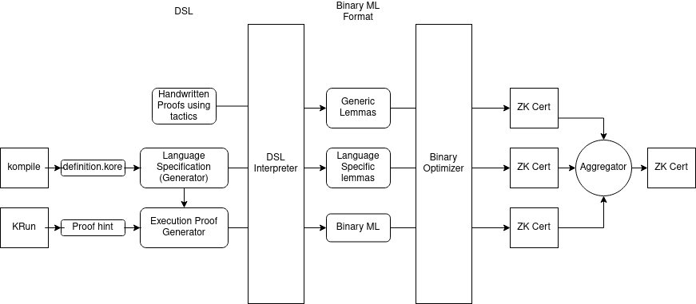

# Proof Generation Architecture

## High Level Overview


Various K tools produce an informal "proof hint", containing all the information
needed for producing the proof, including rules applied simplifications made and
domain reasoning.

This is transformed into a formal proof via matching logic proof tactics
represented in a Python DSL. The formal proof is represented into a simple
binary format. This may be verified by a proof checker and certified using ZK
technologies.

## Detailed Architecture



### Proof hint

A proof hint is an informal artifact produced during the run of an instrumented algorithm.
For example, the LLVM backend produces a stream of rewrites applied and simplifications made.
The resolution decision procedure for propositional formulae produces binary DAG over propositions.


### Binary AML Proof

To represent the proof of a claim in AML, we need four components

1.  An `ml-theory` file encodes a list of axiom patterns represented in an efficient binary language.
2.  An `ml-claims` file encodes a list of claim patterns represented in the same language.
3.  An `ml-proof` file encodes proofs of the claims in an `ml-claims` file assuming the axioms in an `ml-theory`
4.  An `ml-metadata` file encodes the information needed for pretty printing axioms, claims, and proofs defined in the above binary format.
    This includes the names for symbols, axioms, and theorems, as well as mixfix representations for notations etc.
    This is an vital and important part of an AML proof. Otherwise we would not be able to read the axioms in a Theory,
    or the claims that are proved. And how can we trust something we cannot read?

Eventually, through the use of notation, our goal is to be able to reconstruct
a human readable language specification from the `ml-theory` and the `ml-metadata`.
It will likely be at the same level of abstraction as the current Kore specification,
though, hopefully more user-friendly.


### Python DSL

The binary proof language aims to be a
low-level machine interpretable language with a clear mathematical semantics.
This allows it to be easily verified by the proof checker.

This makes is difficult to work with directly to write or generate proofs.
The Python DSL aims to be a high-level language for easy human readability
and a library for proof generation.


### ZK Certificate

ZK certifies that there exists an "ml-proof" for a set of "ml-claims" wrt an "ml-theory".
Since this certificate "rolls up" the proof, it is not one of the public inputs.
Thus, besides the cryptographic components, a ZK Certificate contains just two parts:

1.  "ml-theory" defining the set of axioms used.
2.  "ml-claims" defining the set of claims proved.

There are two ways for producing a proof cerificate:

1.   First, we may produce a certificate by checking Binary ML proofs
2.   Second, we may aggregate two certificates together.


### Proof Aggregation

The binary proof format is not intended to be massively parallizable.
We instead expect the proofs to be broken up into multiple
sub-proofs of reasonable size each with its own theory, claims and proofs.
For example, we expect a proof of program execution to be broken up at least into the following components:

*   Generic Matching Logic Lemmas including propositional logic lemmas, frame-reasoning, and fixpoint related lemmas.
*   Generic K related lemmas including term algebras, maps, ints, sorts etc.
*   Language specific lemmas: shortcuts for easy application of rules summarizing a single rule exection into a lemma.
*   Program specific lemmas: Through the use of the KSummarizer, we may replace execution of multiple consecutive rules, e.g. for the body of a for loop into a single lemma.
*   For long executions we may a single execution trace into sub-executions with perhaps a few though thousand execution steps in each subproof.

Possible ways to aggregate or re-use proofs are:

1.  Extension: If the union of the `ml-theory` and `ml-claims` of one proof are the subset of the `ml-theory` of another
    then we assume the existance of a proof with the `ml-theory` of the first, and the `ml-claims` as the union of their `ml-claims`.
    The resulting aggregated proof will have an `ml-theory` and `ml-claims` component, but no `ml-proof` component, and instead refer to the subproofs.

    Since membership checking and unions are fairly cheap operations over Merkle trees I think this should be a relatively cheap operation in ZK.

2.  Instantiation:
    If certificate includes a symbol, then we may replace all instances of that symbol  (in both the `ml-theory` and `ml-claim`) with an arbitary pattern.
    This gives us a way to handle derived rules.

## Proof Generation DSL

### `ProofExpression`s

At the loweset level of abstraction of the DSL we have `ProofExpression`s.
These have Python methods corresponding to each matching logic construct
and proof rule.
**This low level API is a one-to-one reflection of the Binary language.**
Each of these methods are interpreted by the `Interpreter` implementations
described below.
Higher level tactics and convenience functions for proof building
may be built on top of these methods for convenience and ease of use.

Examples of `ProofExpression`s and `ProofExpression` generators

*   Handwritten proof expressions, e.g. for propositional lemmas
*   Proofs produced by the resolution decision procedure for  propositional tautologies
*   Deserialization of Binary proofs
*   Proofs of execution

### `Interpreter`s

`ProofExpression`s may be interpreted in different ways.
The obvious way is to check that the proof is a valid matching logic proof.
Otherways are pretty printing to unicode or latex,
serializing to the binary proof format,
optimizing by extracting lemmas,
removing redundant substitutions etc.

Examples:

*   `BasicInterpreter`: Verifies that proofs are logically sound
*   `StatefulInterpreter`:
    Explicitly keeps verifier state such as the stack of lemmas proved so far.
    These are only implictly kept track of in the `BasicInterpreter`,
    via pythons runtime stack etc.
*   `PrettyPrintingInterpreter`, `SerializingInterpreter`:  writes proofs to files.
*   `MemoizingInterpreter`: optimizes proofs


## Generating Proofs of Execution

### Kore Language Specification (`definition.kore`)

Kore is a language at an abstraction somewhere between the high-level K format and applicative matching logic. 
It is at slightly higher level than many-sorted polyadic matching logic.
Since Kore was developed before the semantics of K in matching logic was completely fleshed out
there are some outdated concepts and unsoundness
(in particular with reference to sort injections).
As such, we use this as a guideline to produce a formal AML theory rather than an absolute source of truth.


### DSL Langauge Specification

A DSL language specification is a `ProofExpression` generator
aimed at formalizing a language defined in K.
It is generated using a Kore Language specification as a guide.
This specification needs to patch any unsoundness in the Kore Language Specification,
and represents a formal, sound, AML theory for the language.
It is presented by the `RewriteTheory` class below.

```
class RewriteTheory:
    # Builder
    # =======

    def module(name: str) -> RewriteModule:
        ...

    class RewriteModule:
        # Builder
        # =======

        def import(name: str) -> RewriteModule: ...
        def sort(name: str) -> KSort: ...
        def hooked_sort(name: str) -> KSort: ...
        def constructor(name: str, ...) -> KSymbol: ...
        def cell(name: str, ...) -> KSymbol: ...
        def function(name: str, ...) -> KSymbol: ...
        def subsort(KSort, KSort) -> Ordinal: ...
        def equational_rewrite(requires, lhs, ensures, rhs) -> Ordinal: ...
        def rewrite_rule(requires, lhs, ensures, rhs) -> Ordinal: ...

        # Accessors
        # =========

        def get_sort(str) -> KSort:

        # Methods
        # =======

        def generate_axioms() -> list[Pattern]:

    # Accessors
    # =========

    def get_rule_by_ordinal(int: ordinal) -> RewriteRule | EquationalRule:
        ...

    def get_modules() -> list[RewriteModule]:


class SingleRewriteTheory(RewriteTheory):
    """ This pseudocode is a manual translation of the "SingleRewrite"
        K Definition.
    """

    def definition(self):
        with self.module('BASIC-K') as mod:
            # Adds the symbols for `inhabitants_K`, `inhabitants_KItem`
            mod.sort('K')
            mod.sort('KItem')

        with self.module('KSEQ') as mod:
            basic_k = mod.import('BASIC-K')
            sort_k = basic_k.get_sort('K')
            sort_kitem = basic_k.get_sort('KItem')

            # Check for `constructor` attribute
            kseq = mod.constructor('kseq',
                                input=(sort_kitem, sort_k)
                                output=sort_k
                           )
            dotk = mod.constructor('dotk', input=(), output=sort_k)

            # Check for `functional` attribute, but no `constructor` attribute.
            append = mod.function('append',
                            input=(sort_k, sort_k)
                            output=sort_k
                        )

            # Axiom without other attributes?
            # Ask K team to add an attribute to identify these.
            mod.equational_rewrite( append(kseq(KVar('K'), KVar('KS')), KVar('X1'))
                                  , kseq(KVar('K'), append(KVar('KS')), KVar('X1'))
                                  )

        with self.module('INJ') as mod:
            # `symbol inj` is a special case.
            # We ignore the symbol declaration and the simplification axiom
            # over `inj` as well.

        with self.module('K') as mod:
            mod.import('KSEQ')
            mod.import('INJ')

        with self.module('SINGLE-REWRITE') as mod:
            mod.import('K')
            sort_top_cell = mod.sort('SortTopCell')
            sort_counter_cell = mod.sort('SortCounterCell')
            sort_foo = mod.sort('Foo')

            sort_int = mod.hooked_sort('Int')

            sort_k = mod.get_sort('K')

            # Check for `cell`, `cellName` attribute
            counter_cell mod.cell('generatedCounter', input=(sort_int,), output=sort_counter_cell)
            top_cell = mod.cell('generatedTop', input=(sort_top_cell, sort_counter_cell), output=sort_counter_cell)
            k_cell = mod.cell('k', input=(sort_k,), output=sort_k_cell)

            fooa = mod.constructor('FooA', input=(), output=sort_foo)
            foob = mod.constructor('FooB', input=(), output=sort_foo)

            # Check for `subsort` attribute
            mod.subsort(sort_k_cell, sort_k_item)
            mod.subsort(sort_foo, sort_k_item)
            mod.subsort(sort_top_cell, sort_k_item)
            mod.subsort(sort_int, sort_k_item)

            # All *axioms* with `functional`, `constructor`, `assoc`, `unit`, `idem` attributes can be ignored.
            # They are covered by the corresponding attribute of symbol declarations.

            # Check for `\rewrites` at root of pattern
            # TODO: Ask K Team to add an attribute.
            mod.rewrite_rule( mod.constrained_term(top_cell(k_cell(kseq(fooa()))))
                              mod.constrained_term(top_cell(k_cell(kseq(foob()))))
                            )


class ExecutionProofGenerator:
    def __init__(self, theory: RewriteTheory, init_config: Pattern):
       self.init_config = initial_config
       self.curr_config = initial_config
       """ Invariant: Holds a proof for `init_config =>* curr_config` """
       self.proof : ProofExpression = ...


    def rewrite_event(rule_ordinal: int, substitution):
        """ Extends the proof with an additional rewrite step """
        ...

    class SimplificationContext:
        generator: ExecutionProofGenerator

        def enter_subcontext(position: list[int]) -> SimplificationContext:
            ...

        def apply_funtional_simplification(...):
            """ Apply a functional simplification to the term at the position of this context. """
            ...

        def apply_builtin_simplification(...):
            """ Apply a builtin simplification to the term at the position of this context.
                Record axioms needed.
            """
            ...


    def enter_context(position: list[int]) -> SimplificationContext:
        ...


    def finalize(...) -> ProofExp:
        """ Returns a proof expression for the claim `
            whose axioms include all assumptions needed,
        """


    @staticmethod
    def from_llvm_proof_hint(...) -
```
